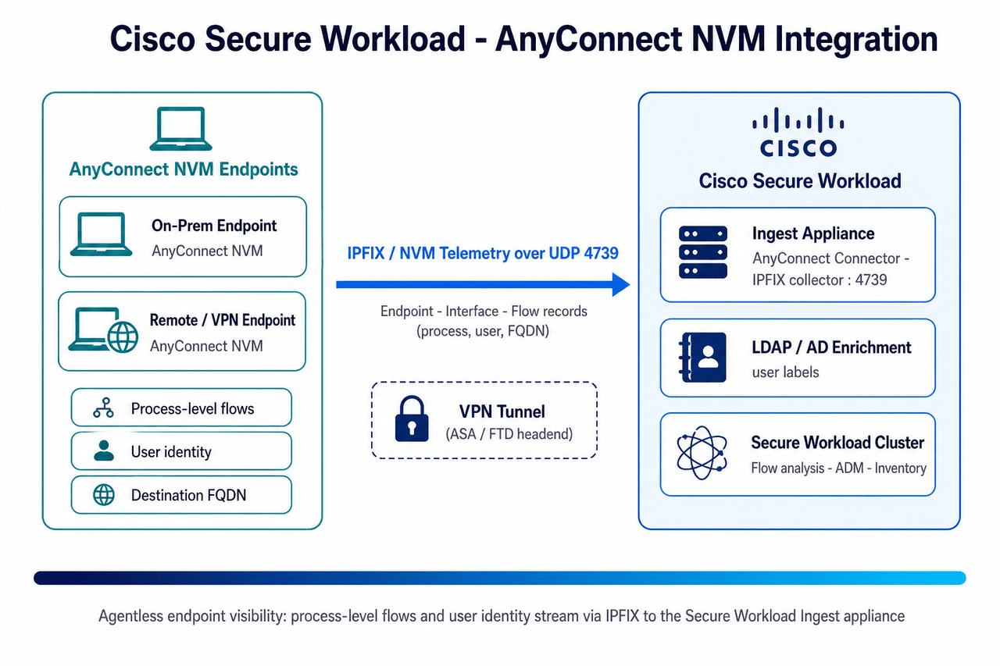

# Cisco Secure Workload → AnyConnect NVM Integration Guide

A step-by-step integration guide for gaining **endpoint flow visibility** in Cisco Secure Workload (CSW) using the **Cisco AnyConnect Network Visibility Module (NVM)**. NVM exports **process-level flow, interface, and endpoint records** in **IPFIX** to the **AnyConnect Connector** on a CSW **Ingest appliance** — no separate CSW agent required on the endpoint.

[-1BA0A2)](https://www.cisco.com/c/en/us/products/security/anyconnect-secure-mobility-client/index.html)

> **⚠ Disclaimer:** This is a **community reference guide** prepared by Cisco Solutions Engineering — not an official Cisco product document. Always refer to the [official Cisco Secure Workload documentation](https://www.cisco.com/c/en/us/support/security/tetration/series.html) and the [Compatibility Matrix](https://www.cisco.com/c/m/en_us/products/security/secure-workload-compatibility-matrix.html) for authoritative, up-to-date guidance.

---

## What This Covers

| Area | Detail |
|---|---|
| **Integration type** | Endpoint **flow telemetry** via the **AnyConnect Connector** (IPFIX collector) |
| **Data imported** | **Endpoint**, **Interface**, and **Flow** records — 5-tuple, bytes, **process name/path**, **username**, destination **FQDN** |
| **Transport** | AnyConnect NVM → **IPFIX** over **UDP 4739** → AnyConnect Connector on a CSW **Ingest appliance** |
| **Coverage** | On-premises **and** off-premises (VPN) endpoints — records tunnel back over the VPN |
| **Enforcement** | **None** — this integration is **telemetry / visibility and labeling only** (no policy is pushed to endpoints) |
| **User labels** | Optional **LDAP/AD** enrichment adds `user/*` attributes to endpoint flows |
| **Result** | Endpoints appear in inventory as AnyConnect agents with `proc/*` and (optional) `user/*` context for ADM and Zero Trust |
| **Verified against** | CSW 3.x+; AnyConnect **4.2+** (NVM records), **4.9+** (agent version reporting) |

---

## Quick Start

### Prerequisites
- Cisco AnyConnect Secure Mobility Client **4.2+** with the **Network Visibility Module (NVM)** enabled
- An **NVM profile** (XML) pointing the IPFIX collector at the CSW **Ingest appliance** IP on **UDP 4739**
- A CSW **Ingest appliance** deployed and registered (the AnyConnect Connector runs here)
- **VRF** configuration on the appliance covering the endpoint subnet(s)
- (VPN endpoints) ASA/FTD headend permitting IPFIX (UDP/4739) through the tunnel
- (Optional) LDAP/AD server reachable for `user/*` label enrichment
- Firewall: UDP/4739 from endpoints (and via VPN headend) → CSW Ingest appliance

### Steps (summary)

**On endpoints — deploy NVM:**
1. Author an `NVM_Profile.xml` with `CollectorAddress` = Ingest appliance IP, `CollectorPort` = `4739`, `CollectorProtocol` = `UDP`
2. Push the profile via **ASA/FTD** headend, **Cisco ISE** client provisioning, or **MDM** (Intune/JAMF)
3. Confirm NVM is exporting (AnyConnect → Statistics → NVM → *Flows Exported* incrementing)

**On Cisco Secure Workload:**
1. `Manage → Virtual Appliances` → select your **Ingest appliance**
2. **Connectors** → **+ Add Connector** → **AnyConnect**
3. Add an **Agent Remote VRF Configuration** (VRF name, endpoint subnet CIDR, port range `4739-4739`)
4. (Optional) add **LDAP** config for `user/*` enrichment → **Test and Apply**

**Verify:**
1. Connector shows **Status: Active**; on the appliance `tcpdump -i any -n port 4739` shows IPFIX
2. `Inventory → Workloads` — endpoints appear as **AnyConnect Agent**
3. `Observe → Traffic` — flows carry `proc/name` / `proc/path` (and `user/*` if LDAP enabled)

See the [full step-by-step guide](CSW-AnyConnect-NVM-Integration-Guide.md) or [open the HTML version](CSW-AnyConnect-NVM-Integration-Guide.html) for detailed instructions.

---

## Video References

> **Legend:** 🎬 video · 📘 guide · 📄 doc

| Reference | What it shows |
|---|---|
| [🎬 CSW User Education video library](https://github.com/chandrapati/CSW-User-Education) | Curated Secure Workload concept explainers and walkthroughs |
| [📘 AnyConnect NVM Integration Guide](CSW-AnyConnect-NVM-Integration-Guide.md) | This repo's full step-by-step deployment guide |
| [📄 Cisco docs — AnyConnect Connector](https://www.cisco.com/c/en/us/td/docs/security/workload_security/secure_workload/user-guide/4_0/cisco-secure-workload-user-guide-on-prem-v40/configure-and-manage-connectors-for-secure-workload.html) | Authoritative connector behavior, record types, and limits |

---

## Architecture Diagram

*AnyConnect NVM on on-prem and remote (VPN) endpoints exports Endpoint/Interface/Flow records as IPFIX over UDP 4739 to the AnyConnect Connector on a CSW Ingest appliance; optional LDAP/AD enrichment adds user identity — feeding flow analysis, ADM, and inventory.*

---

## Files in This Repo

| File | Description |
|---|---|
| [`README.md`](README.md) | This file — quick start and overview |
| [`CSW-AnyConnect-NVM-Integration-Guide.md`](CSW-AnyConnect-NVM-Integration-Guide.md) | Full step-by-step guide (Markdown source) |
| [`CSW-AnyConnect-NVM-Integration-Guide.html`](CSW-AnyConnect-NVM-Integration-Guide.html) | Styled HTML — open in browser for best experience |
| [`csw-anyconnect-nvm-architecture.png`](csw-anyconnect-nvm-architecture.png) | Architecture diagram |
| [`build.sh`](build.sh) | Regenerate HTML from Markdown (requires pandoc) |

---

## Imported Data & Labels — Quick Reference

**Flow record fields** (per connection): `5-tuple` · bytes in/out · **process name** (`proc/name`) · **process path** (`proc/path`) · **username** · destination **FQDN**.

**Optional LDAP/AD user labels** (one per attribute mapped):

| Key | Value |
|---|---|
| `user/username` | *(logged-in user, e.g. `jsmith`)* |
| `user/department` | *(AD `department`)* |
| `user/title` | *(AD `title`)* |
| `user/*` | *(up to 6 additional AD attributes)* |

> **Important:** AnyConnect NVM is a **visibility** integration — it does **not** enforce policy on endpoints. Limits: **1** AnyConnect connector **per Ingest appliance** and **1 per tenant**; the IPFIX collector listens on **UDP 4739** (changeable via `update-listening-ports`).

---

## Step-by-Step Guides

> **Legend:** 🎬 video · 📘 guide · 📄 doc

Hands-on integration and deployment guides — follow these top to bottom to build out a deployment:

| Guide | Description | Best for |
|-------|-------------|---------|
| [📘 Agent Installation](https://github.com/chandrapati/CSW-Agent-Installation-Guide) | Deploy CSW agents on Linux / Windows / cloud | Day-1 sensor deployment |
| [📘 Policy Lifecycle](https://github.com/chandrapati/CSW-Policy-Lifecycle) | Policy discovery → enforcement workflow | Policy management |
| [📘 ISE / pxGrid](https://github.com/chandrapati/csw-ise-integration) | ISE/pxGrid: user-identity–aware microsegmentation | Identity & Zero Trust |
| [📘 AnyConnect NVM](https://github.com/chandrapati/csw-anyconnect-nvm) | Endpoint process flows + user identity via NVM | Endpoint telemetry |
| [📘 ServiceNow CMDB](https://github.com/chandrapati/csw-servicenow-integration) | ServiceNow CMDB label enrichment for workload scopes | CMDB-driven policy |
| [📘 Infoblox](https://github.com/chandrapati/csw-infoblox-integration) | Infoblox IPAM/DNS extensible-attribute label enrichment | IPAM/DNS-driven policy |
| [📘 F5 BIG-IP](https://github.com/chandrapati/csw-f5-integration) | F5 virtual-server labels, policy enforcement, IPFIX flow visibility | Load balancer segmentation |
| [📘 NetScaler ADC](https://github.com/chandrapati/csw-netscaler-integration) | NetScaler LB virtual-server labels, ACL enforcement + AppFlow/IPFIX flow visibility | Load balancer segmentation |
| [📘 AWS Connector](https://github.com/chandrapati/csw-aws-connector) | EC2 tag ingestion + VPC flow logs + Security Group enforcement | AWS workloads |
| [📘 Azure Connector](https://github.com/chandrapati/csw-azure-connector) | Azure VM tag ingestion + VNet flow logs + NSG enforcement | Azure workloads |
| [📘 GCP Connector](https://github.com/chandrapati/csw-gcp-connector) | GCE label ingestion + VPC flow logs + firewall enforcement | GCP workloads |
| [📘 NetFlow](https://github.com/chandrapati/csw-netflow-integration) | NetFlow v9/IPFIX agentless flow ingestion from switches | Network fabric visibility |
| [📘 ERSPAN](https://github.com/chandrapati/csw-erspan-integration) | Agentless packet mirroring for legacy / OT / IoT devices | Deep agentless visibility |
| [📘 Secure Firewall](https://github.com/chandrapati/CSW-Secure-Firewall-Integration-Guide) | NSEL flow ingestion from Cisco Secure Firewall (FTD/ASA) | Firewall flow visibility |
| [📘 Splunk Integration](https://github.com/chandrapati/csw-splunk-integration) | CSW syslog alerts → Splunk SIEM | SecOps / SIEM teams |

## Resources

> **Legend:** 🎬 video · 📘 guide · 📄 doc

Learning paths, reference material, and day-2 tooling:

| Resource | Description | Best for |
|----------|-------------|---------|
| [📘 User Education](https://github.com/chandrapati/CSW-User-Education) | Onboarding guides, concept explainers, and curated video library | New CSW users |
| [📘 Compliance Mapping](https://github.com/chandrapati/CSW-Compliance-Mapping) | Map CSW controls to NIST, PCI-DSS, HIPAA, CIS | Compliance & audit |
| [📘 Tenant Insights](https://github.com/chandrapati/CSW-Tenant-Insights) | Tenant-level reporting and analytics | Visibility metrics |
| [📘 Operations Toolkit](https://github.com/chandrapati/CSW-Operations-Toolkit) | Day-2 ops scripts: health checks, reporting, policy analysis | Ongoing operations |
| [📄 Supported OS & Compatibility Matrix](https://www.cisco.com/c/m/en_us/products/security/secure-workload-compatibility-matrix.html) | Cisco's authoritative list of supported agent operating systems, external systems, and connector requirements | Platform planning & prerequisites |

> **Suggested customer journey:**
> User Education → Agent Installation → Policy Lifecycle → ISE/pxGrid → ServiceNow CMDB → Infoblox → F5 BIG-IP → NetScaler ADC → Splunk Integration → Compliance Mapping → Operations Toolkit
